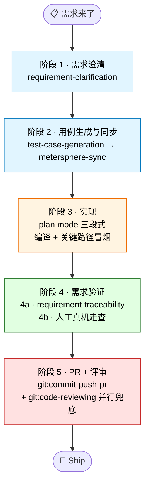

# AI 辅助需求开发实践参考

> 借助 `claude-plugins-marketplace` 的 test 插件进行需求开发和测试验证的标准方法。
>
> 本文档聚焦**怎么把 test 插件用起来**，不复述各 skill 的内部机制 — 那些请直接参考 skill 的 `SKILL.md`。
>
> **受众**：使用 test 插件做完整需求开发的工程师 / Tech Owner，以及第一次跑流程不稳定想找对姿势的人。

---

## 按问题查（半路进来的人看这里）

| 我现在的问题 | 跳转 |
| --- | --- |
| 第一次跑，从哪开始？ | [§0 Quickstart](#0--quickstart-第一次跑) |
| 已经有需求文档，想开始澄清 | [阶段 1](#阶段-1--需求澄清) |
| 用例生成完了，怎么同步 MS | [阶段 2](#阶段-2--用例生成与同步至-ms) |
| 进入开发了，plan mode 怎么用 | [阶段 3](#阶段-3--实现) |
| 代码改完了，怎么自验 | [阶段 4](#阶段-4--需求验证) |
| traceability fail / inconclusive 项怎么处理 | [阶段 4a](#子步骤-4a--ai-还原度检查) |
| skill 跑挂了 / MS 同步报错 | [Troubleshooting](#troubleshooting) |
| 看到「FP / Prepare / 中置信」不懂 | [术语小词典](#术语小词典) |
| 想知道哪些做法会翻车 | [反模式](#反模式别这么干) |
| 想看 TapTap 真实案例 / 团队角色分工 | [团队补充材料（飞书）](https://xd.feishu.cn/wiki/PgRLwgQj2iUkiGk0Xm8ctGMWnTb) |

---

## §0 · Quickstart（第一次跑）

> 五步内能起飞。已经跑过的人跳到[阶段 1](#阶段-1--需求澄清)。

**1. 装插件**

```
/plugin install test@taptap-plugins
```

装完 `/help` 应能看到 `test:requirement-clarification` 等命令。装不上看 [README.md](../../README.md) 配 marketplace。

**2. 设 workspace（一个需求一个目录）**

```bash
export TEST_WORKSPACE=plugins/test/workspace/<kebab-case-需求名>
mkdir -p $TEST_WORKSPACE
```

例如 `plugins/test/workspace/add-coupon-feature`。所有 skill 的产物会汇聚到这个目录，跨 skill 自动消费上游产出。`workspace/` 已在 `.gitignore` 里。

**3. MS 凭据 + 项目元数据**

不用提前手动配。第一次跑 `metersphere-sync` 报 `missing required environment variables` 时，打开飞书 [MeterSphere 配置 (.env)](https://xd.feishu.cn/wiki/K4Cxw8HE5itR16kFFYicSctAnrc) 把配置块整段粘给 AI，让它写入 `plugins/test/skills/shared-tools/scripts/.env` 即可。

> ⚠️ `.env` 在 `.gitignore` 里，**不要**把 key 贴到 PR / 群聊 / 公开 issue。

**4. 第一句 prompt**

把下面这段直接粘到 Claude Code 输入框，改三个变量：

```
用 test:requirement-clarification 澄清需求。
- 需求文档: <飞书 / wiki / 群聊摘录均可>
- 关联资料: <PRD / 设计稿 / 同主题历史 PR，没有就写 "无">
- 补充约定: <PM 已 ack 但文档没写的事，没有就写 "无">
```

**5. 不知道下一步做什么**

跑完一个 skill 就回这份文档对着[30 秒速查](#30-秒速查)看下一阶段是什么。整条工作流 5 阶段，跑两次就熟了。

---

## 30 秒速查



| 阶段 | 主 skill | 一句话 |
| --- | --- | --- |
| 1 · 需求澄清 | `test:requirement-clarification` | 把需求 + 关联资料一次喂全，产出功能点 / 验收标准 / 任务清单 |
| 2 · 用例生成与同步 | `test:test-case-generation` → `test:metersphere-sync` | 生成 E2E 用例并幂等同步到 MeterSphere 测试计划 |
| 3 · 实现 | 无主 skill（plan mode 三段式） | 设计 → 评审 → 实施，每完成一个任务点编译一次 |
| 4 · 需求验证 | `test:requirement-traceability` + 人工真机走查 | AI 跑还原度（diff 对照需求），人工补真机 UI / 体验验收 |
| 5 · PR + 评审 | `git:commit-push-pr` + `git:code-reviewing` | 创建 PR/MR，并行跑 AI 代码审查；PR description 含完整 test plan |

> **MS = MeterSphere**：团队使用的测试管理平台。完整术语见[术语小词典](#术语小词典)。

---

## 分阶段 SOP

### 阶段 1 · 需求澄清

**做什么**：把需求描述 + 设计稿 + 你的额外信息合并成一份「AI 和团队都能对齐」的结构化需求理解，明确所有边界 + 决策。

**用什么 skill**：`test:requirement-clarification`

**📥 复制即用 prompt**

```
用 test:requirement-clarification 澄清需求。

需求文档: <飞书 / wiki / Notion 链接，或一段文字描述>
关联工作项: <工单 ID，没有就写 "无">
设计稿: <Figma 链接或截图，没有就写 "无">
关联 MR/PR: <其它端已实现的 MR 链接，多个用逗号，没有就写 "无">
现有代码路径: <如改造已有功能，列模块根目录，没有就写 "无">
补充约定: <PM 口头 ack 但文档没写的事，没有就写 "无">
```

**📥 最小输入**：模板里**至少有需求文档**就能启动；其它项越全，澄清轮次越少。

**✅ 期望产出**：一组结构化需求文档（功能点清单、验收标准、平台约束、依赖关系、实现任务清单），所有边界已 PM 确认。

#### 💡 核心原则 — 上下文前置

AI 不读你脑子里的东西，它只能用**你显式给的输入** + 它**主动拉的信息**。前者你能控制，后者拼运气。所以**能先贴的就先贴**，不要等它问。

常被遗漏的输入：

| 信息 | 来源 | 怎么用 |
| --- | --- | --- |
| 关联需求 / 同主题资料 | 工单系统 / 同事告知 | 「这是 X 需求的扩展」「同主题之前做过 Y」 |
| 关联 PR/MR | 同事告诉你 / 工单链接 | 「Server 已合到 MR!19147」 |
| 公司术语 | 团队约定 | 「我们说『需求』指功能改动，不含 bug 修复」 |
| PM 口头决策 | 沟通群 | 「PM 已确认按方案 A 走」 |

实操技巧：

- **多端 MR 挖掘**：如果其它端已上线，**贴上他们的 MR 链接** — AI 能从对端代码挖出 API 契约 / 业务规则 / 文案规范，比文档更精确（真实案例见飞书[团队补充材料](https://xd.feishu.cn/wiki/PgRLwgQj2iUkiGk0Xm8ctGMWnTb)）
- **设计稿原图 vs 链接**：链接需要 Figma MCP 才能拉，没启用就贴截图
- **PM 已 ack 的事**：用「补充约定：…」段落显式贴出，AI 不会自己脑补

跑完看输出里的 `open_questions`：如果一堆都是「需要查 X」「需要找 Y 文档」，说明你最开始没把信息给够，回去补。

#### 💡 核心原则 — 早澄清

返工的根因常常不是代码写错，而是**对需求理解错了**。AI 比人更擅长机械生成代码，**对模糊需求的判断力不如人**。

- 宁可多问 2 轮，别带歧义进开发
- 边界场景在澄清阶段就抛（多 tab 行为差异、特殊角色 / 类型例外、边界数据、异常路径）

---

### 阶段 2 · 用例生成与同步至 MS

**做什么**：把澄清产物拆成可执行的测试用例，并同步到团队的测试管理平台（MS）。

**用什么 skill**：`test:test-case-generation` → `test:metersphere-sync`

**📥 复制即用 prompt**

```
用 test:test-case-generation 基于 $TEST_WORKSPACE 里的澄清产物生成用例。
```

确认 `$TEST_WORKSPACE/final_cases.json` 生成 OK 后：

```
用 test:metersphere-sync 把 $TEST_WORKSPACE/final_cases.json 同步到 MS，
计划名: <需求名或工作项 ID，如 TAP-XXXXXXX>
```

**📥 必备输入**：阶段 1 的全部产物（已经在 `$TEST_WORKSPACE` 里，skill 会自动读）

**⚠️ 容易踩的坑**

- 第一次跑会报 `missing required environment variables` — 把飞书 [MeterSphere 配置 (.env)](https://xd.feishu.cn/wiki/K4Cxw8HE5itR16kFFYicSctAnrc) 整段贴给 AI，它会帮你写到 `.env`
- 同步是**幂等**的：同名计划存在就追加，不会重复，可以放心多跑几次
- 这阶段只产出 **E2E 验收级用例**；单测 / 集成测延到阶段 3 实现完成后由 `unit-test-design` / `integration-test-design` 读代码判断，不要在这一步纠结

**✅ 期望产出**：MS 测试计划上能看到完整用例集，开发和 QA 都可消费。

---

### 阶段 3 · 实现

**做什么**：根据阶段 1 的任务清单，AI 主写 + 你 review 完成代码改动。

**用什么 skill**：无专属主 skill — plan mode 是 Claude Code 自带能力，直接用就行。

#### plan mode 三段式

**① 设计**

用 Shift+Tab 切换到 plan mode，把下面这段粘进去：

```
按 $TEST_WORKSPACE/clarified_requirements.json 里的任务清单出实现计划。

参考：
- 项目架构约定: <vibe-coding-rules / architecture-overview / ui-component-catalog 等约定文档路径>
- 现有相似实现: <可参考的代码路径，如 ChatListViewController>

要求：
1. 按任务点拆步骤，每步要能独立编译通过
2. 标出每步会改 / 新建哪些文件
3. 标出影响面：是否触碰共享组件、父类、跨模块接口
4. 给出关键决策点（命名、数据流、错误处理走哪边）
```

**② 评审**

exit plan 前不要无脑 accept。盯三件事：

| 检查项 | 问 AI 什么 | 不通过怎么办 |
| --- | --- | --- |
| 影响面 | 「这个改动有没有动到 X 的子类 / 共享组件 / 公共 API？列出所有调用方」 | 改动面比预期大 → 让 AI 补一段「影响面验证」步骤，跑代码搜索 |
| 分步顺序 | 「第 N 步执行完，工程能编译通过吗？跑得起来吗？」 | 不能 → 让 AI 重新拆，每步一个可编译切面 |
| 回滚成本 | 「如果第 N 步发现方向错了，要回滚多少代码？」 | 单步太大 → 拆小，或者把高风险步骤前移先验证 |

**③ 实施**

- 按计划改代码，**每完成一个任务点编译一次**，不要堆到最后才 build
- 关键节点跑一下冒烟（启动 + 主流程点一下，不崩就行）
- 计划中途改了，回头更新 plan，不要让代码和计划各跑各的

#### 辅助 skill（按需）

- `test:unit-test-design` / `test:integration-test-design` — 实现完之后让 skill 读代码判断哪些纯函数 / 接口值得下沉单测 / 集成测，跳过项会列在 `test_plan.md` 里有据可查

**✅ 期望产出**：编译通过 + 关键路径冒烟（确保不崩）。系统性的真机走查留到阶段 4b。

---

### 阶段 4 · 需求验证

**做什么**：从「代码层」+「真机层」两侧把改动对照阶段 1 的需求做正向核对，确保功能 / 视觉 / 体验都到位。**AI 抓代码-需求映射，人盯真机表现，缺一不可**。

#### 子步骤 4a · AI 还原度检查

**用什么 skill**：`test:requirement-traceability`

**📥 复制即用 prompt**

代码还没 commit：

```bash
git diff HEAD > $TEST_WORKSPACE/local.diff
git diff --cached >> $TEST_WORKSPACE/local.diff
```

```
用 test:requirement-traceability 把 $TEST_WORKSPACE/local.diff 对照
$TEST_WORKSPACE 里的需求和用例做还原度检查。
```

或者已经有 PR/MR：

```
用 test:requirement-traceability 把 <PR/MR URL> 对照
$TEST_WORKSPACE 里的需求和用例做还原度检查。
```

**📥 必备输入**：阶段 1+2 的全部产物（在 `$TEST_WORKSPACE` 里）+ 代码变更（diff 文件 / PR 链接均可，**不用先建 PR**）

**🔄 自动附带的检查**（traceability 内嵌，无需额外调用）：

- **UI 还原度**：prompt 里同时给 `design_link`（Figma URL）+ `code_dir`（前端代码目录）→ §3.4 自动启动 `ui-fidelity-checker` agent，产出 `ui_fidelity_report.json` 合并到主报告。**纯静态对比**，不需要部署页面
- **API 契约校验**：代码变更涉及 API 时（前后端 diff 都有 / 含路由 / 含 DTO）→ §3.2.5 自动启动 `api-contract-validator` agent，产出 `api_contract_report.json`。如果想做 PR pre-merge gate 单独跑契约校验，可独立调用 `test:api-contract-validation`

**⚠️ 容易踩的坑**

- **fail 项必须人复核**：AI 静态分析倾向「能找出毛病就标 fail」，不复核会把 false positive 同步到 MS 计划
- **看置信度分布**：高置信 Pass = 代码层面验证通过；中置信 Pass 通常依赖真机 / server / 组件默认行为 — 这部分丢给 4b 重点跑
- **Prepare ≠ 通过**：Pass + 外部依赖会自动降级为 Prepare（语义是「AI 静态过了，等人验证」），不要看到 Pass 字眼就当通过

**✅ 产出**

- 还原度报告 verdict = `pass`（或 `pass_with_caveats`）；`fail` 会列出具体缺口（哪个需求点没实现、哪个用例没通过）；`inconclusive` 表示 AI 判不了，需要人介入
- MS 用例状态自动回写为 Pass / Failure / Prepare（Failure / Prepare 项交给 4b 复核，详见 `metersphere-sync/SKILL.md` P6 状态映射）

#### 子步骤 4b · 人工真机走查

**做什么**：把代码部署到真机 / 浏览器，自己走一遍主流程 + 边界场景，关注 AI 抓不到的视觉、交互、体验。

**为什么不能省**：4a `pass` ≠ 上线 OK。AI 静态分析看不到这些层面：

- 视觉：颜色、间距、对齐、字号、icon 还原
- 交互：手势、动效、loading / 空 / 异常态
- 体验：滚动卡顿、首屏白屏、点击反馈
- 跨端一致性：Server 推送、多端状态同步

**怎么做**

- 4a 输出里的中置信 Pass / Prepare 项，全部在真机上手动复跑一遍
- 走完后到 MS 平台把 Failure / Prepare 状态的用例手动验证并更新

**✅ 产出**：MS 用例全部进入 Pass 状态 + 视觉 / 交互 issue 清单（修完才能进阶段 5）

#### 💡 核心原则 — 多层验证

AI 生成代码 + AI 自己 review = **同一个偏见**，任何一层都可能漏。需求验证占其中两层（4a + 4b），整条链路要叠加：

| 层 | 抓什么 | 对应阶段 |
| --- | --- | --- |
| 编译 | 类型 / 引用错误 | 阶段 3 项目自带 build |
| 静态 / 还原度 | 需求实现完整性、影响面、API 契约 | 阶段 4a · traceability |
| 真机 / 浏览器 | 视觉、交互、体验、跨端一致性 | 阶段 4b · 人工走查 |
| 独立 AI review | 同偏见兜底 | 阶段 5 `git:code-reviewing` |
| 同行 review | 业务 / 架构 / 规范判断 | 阶段 5 PR review |

每跳过一层就承担一份风险。新需求建议**全跑一遍**，迭代型小改动可以省 4b 或独立 AI review。

---

### 阶段 5 · PR + 评审

**做什么**：把改动交付到代码托管平台，触发同行 review + 独立 AI review。

**用什么 skill**（git 插件提供，非 test 插件）：

- `git:commit-push-pr` — 提交、推送、创建 MR/PR、监控 Pipeline
- `git:code-reviewing` — AI 代码审查（Claude Code 下双视角辩论 / Codex 下串行双视角交叉验证）

**📥 复制即用 prompt**

```
用 git:commit-push-pr 提交并创建 PR/MR。
PR description 里包含完整 test plan：每条对应阶段 1 的一个验收标准。
```

PR 创建好之后**并行**跑：

```
用 git:code-reviewing 审查 <PR/MR URL>
```

**⚠️ 两个关键动作**

- **PR description 里写完整 test plan**：每条对应一个验收标准 — 这是后续再跑 traceability 的 anchor
- **跑 `git:code-reviewing`**：和阶段 4a traceability 是不同视角的兜底（一个看实现-需求映射，一个看代码本身），别互相替代

**✅ 期望产出**：PR 通过 review 合并到主干。

---

## 团队补充材料（TapTap 内部）

📚 真实案例复盘（iOS TAP-6841255319）、裸需求场景对比、角色分工（RACI）、内部联系人统一放在飞书：[AI 辅助需求开发实践 — TapTap 团队补充材料](https://xd.feishu.cn/wiki/PgRLwgQj2iUkiGk0Xm8ctGMWnTb)

---

## 反模式（别这么干）

下面这些都是真踩过的坑。看完上面 SOP 不一定记住，但看完反模式大概率不会重犯。

| 反模式 | 会发生什么 | 正确姿势 |
| --- | --- | --- |
| **跳过澄清直接进开发** | 开发到一半发现边界没对齐，回头补澄清 → 推翻已写代码 → 返工成本是「开发时间 × 0.5~2」 | 哪怕需求看起来「很简单」也跑一次澄清，至少把 `open_questions` 列出来 |
| **澄清时只贴需求文档，不贴关联资料** | AI 凭空想象业务规则，澄清产出大量「需要确认」 → 反复来回 → 不如人写 | 关联 MR / 设计稿 / 同主题历史先翻一遍，**贴得越全澄清轮次越少** |
| **traceability 全 Pass 就直接合 PR** | 中置信 Pass / Prepare 项实际依赖真机或 server 表现，AI 静态判不了 → 真机一跑发现视觉 / 交互崩了 | Prepare 项必须真机走查通过才合 PR |
| **把 unit-test-design 提前到澄清阶段** | 这阶段还没代码，skill 只能瞎猜 → 产出空泛的「应该测 X」 → 没用 | 实现完成后再跑 unit-test-design / integration-test-design，让它读真代码判断 |
| **plan mode 一把出大计划，accept 后闷头写到底** | 中途发现方向错，回滚整片代码 | 三段式（设计 → 评审 → 实施），评审环节强制挑战分步顺序和回滚成本 |
| **MS 同步报错就跳过，先把 PR 提了再说** | 用例没在 MS 留痕 → QA 没法回归 → 上线后才发现漏测 | 同步是幂等的，多跑几次；还报错按 [Troubleshooting](#troubleshooting) 排查 |

---

## Troubleshooting

| 现象 | 大概率原因 | 怎么办 |
| --- | --- | --- |
| `/plugin install` 找不到 test 插件 | marketplace 没加 / 没 reload | 看 [README.md](../../README.md) 配 marketplace；装完 `/clear-cache` 一下 |
| skill 报「找不到上游产出文件」 | `$TEST_WORKSPACE` 没设或路径不对 | `echo $TEST_WORKSPACE` 检查；新 shell 要重新 export |
| MS 同步 `missing required environment variables` | `.env` 没配 | 把飞书 [MeterSphere 配置 (.env)](https://xd.feishu.cn/wiki/K4Cxw8HE5itR16kFFYicSctAnrc) 整段粘给 AI，它会帮你写到 `.env` |
| MS 同步 401/403 | `MS_ACCESS_KEY` / `MS_SECRET_KEY` 错或过期 | 去 MeterSphere → 个人信息 → API Keys 重新生成，回填到 `.env` |
| MS 同步 404 / project not found | `MS_PROJECT_ID` 错 | 比对飞书配置文档里的 UUID |
| traceability 输出全是 `inconclusive` | diff 给得不全（漏了 staged / 新文件） | 用 `git diff HEAD` + `git diff --cached` 拼出完整 diff；新文件要先 `git add` 再生成 diff |
| AI 输出明显跑偏（理解错需求） | 上下文给少了或者澄清没做扎实 | 不要硬掰，回阶段 1 重跑澄清并补关联资料 |
| skill 卡在「需要确认」死循环 | 关键决策没人拍板 | 把决策点抛给 PM，拿到答案后写进澄清文档「补充约定」段，重跑 |
| 找不到 skill / 命令不识别 | Claude Code 会话没重启或缓存陈旧 | 跑 `/clear-cache` 然后重启会话 |

排不出来 / 想问角色分工 / 想看 TapTap 真实案例 → 见[团队补充材料](https://xd.feishu.cn/wiki/PgRLwgQj2iUkiGk0Xm8ctGMWnTb)。

---

## 术语小词典

| 术语 | 含义 |
| --- | --- |
| **MS** | MeterSphere — 团队测试管理平台，承接用例和测试计划 |
| **TEST_WORKSPACE** | 环境变量，指向当前需求的产物目录，所有 skill 输出汇聚于此 |
| **FP** | Functional Point，功能点 — 澄清产物里把需求拆成的最小可独立验收单元 |
| **E2E 用例** | End-to-End 验收级用例，对应一个完整业务流程，由 QA 在 MS 上执行 |
| **traceability** | 还原度 — 代码改动 vs 需求/用例的覆盖度对照 |
| **verdict** | traceability 报告结论：`pass` / `pass_with_caveats` / `fail` / `inconclusive` |
| **置信度（confidence）** | AI 对单条判定的把握度，0-100；高置信 Pass = 代码层面验过；中置信 Pass 通常依赖真机/server |
| **Prepare（MS 状态）** | AI 静态过了但有外部依赖未验证，等人复核 — **不等于通过** |
| **Failure（MS 状态）** | AI 判定不通过；要么修代码，要么人复核证伪 |
| **plan mode** | Claude Code 内置模式（`/plan` 或 Shift+Tab），强制先出计划再实施 |
| **冒烟测试** | 跑一遍主流程确保不崩，不追求覆盖完整边界 |

---

## 附：进一步阅读

**🔴 跑流程必读**

- [`requirement-clarification/SKILL.md`](skills/requirement-clarification/SKILL.md)
- [`test-case-generation/SKILL.md`](skills/test-case-generation/SKILL.md)
- [`metersphere-sync/SKILL.md`](skills/metersphere-sync/SKILL.md)
- [`requirement-traceability/SKILL.md`](skills/requirement-traceability/SKILL.md)
- [`CONVENTIONS.md`](CONVENTIONS.md) — `$TEST_WORKSPACE` 等约定

**🟡 按需翻**

- [`unit-test-design/SKILL.md`](skills/unit-test-design/SKILL.md) — 实现完想下沉单测时
- [`integration-test-design/SKILL.md`](skills/integration-test-design/SKILL.md) — 实现完想做集成测时
- [`change-analysis/SKILL.md`](skills/change-analysis/SKILL.md) — 改父类 / 共享组件 / 跨模块 API 时
- [`plugins/git/skills/commit-push-pr/SKILL.md`](../git/skills/commit-push-pr/SKILL.md) — 阶段 5
- [`plugins/git/skills/code-reviewing/SKILL.md`](../git/skills/code-reviewing/SKILL.md) — 阶段 5
